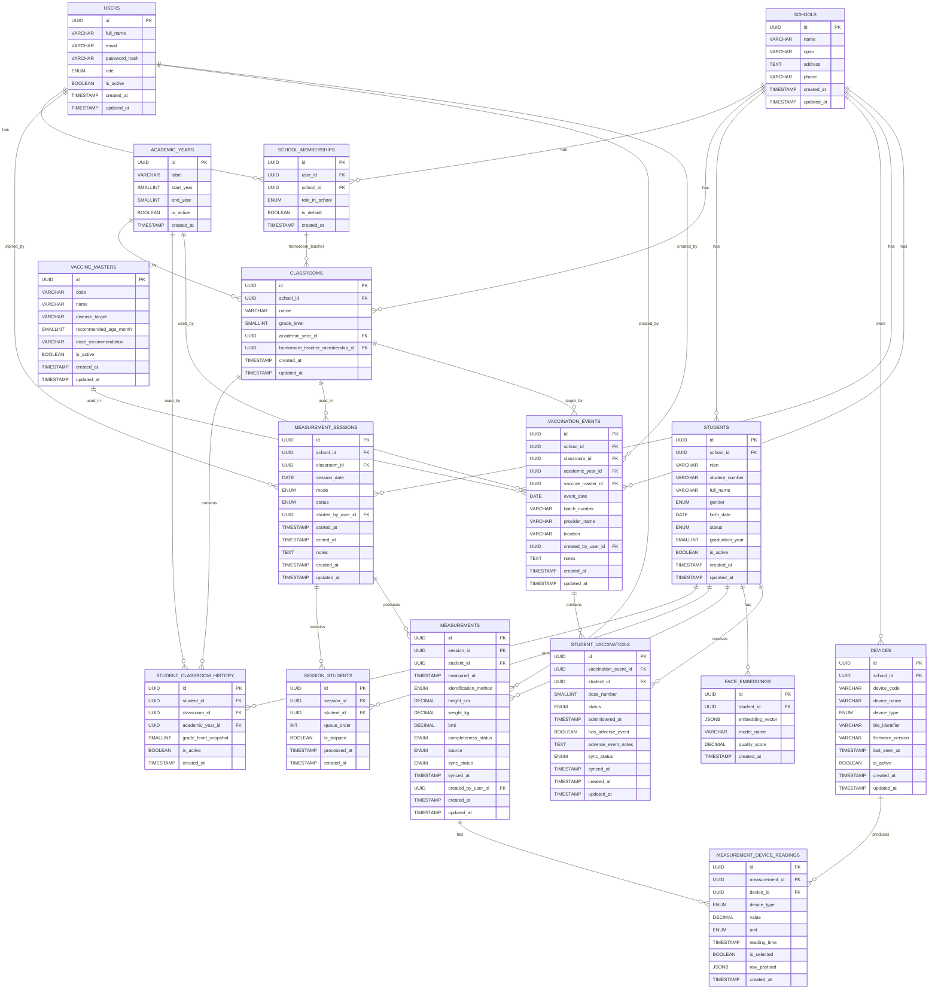

# MySimoka Data Model Documentation

## Overview

Dokumen ini menjelaskan struktur data (ERD) final untuk sistem MySimoka. Tujuan utama adalah memberikan pemahaman yang jelas bagi backend engineer terkait relasi antar entitas, prinsip desain, dan constraint penting.

---

## Design Principles

1. **Academic Year sebagai dimensi utama**

   * Semua data kelas dan histori berbasis tahun ajaran
   * Tidak menggunakan range tanggal (start/end)

2. **Classroom adalah snapshot per tahun ajaran**

   * Classroom berbeda setiap academic year
   * Tidak reuse classroom antar tahun

3. **History over mutation**

   * Tidak overwrite data relasi
   * Gunakan tabel history untuk tracking perubahan

4. **Referential integrity ketat**

   * Gunakan foreign key ke entitas yang tepat
   * Hindari penggunaan string bebas untuk entitas penting

---

## Entity Relationship Diagram (ERD)

---

## Core Entities Explanation

Di bawah ini adalah penjelasan tiap entitas beserta peran, relasi, dan catatan implementasi penting.

### 1. USERS

**Peran**: Identitas pengguna sistem (admin/operator/guru, dll)

* Digunakan untuk autentikasi & otorisasi
* Tidak langsung terikat ke sekolah → melalui `SCHOOL_MEMBERSHIPS`
* Dipakai sebagai `started_by_user_id` (session) dan `created_by_user_id` (measurement)

**Catatan**:

* Gunakan `is_active` untuk soft disable akun

---

### 2. SCHOOLS

**Peran**: Entitas sekolah (tenant utama sistem)

* Semua data lain berada dalam konteks sekolah

**Relasi utama**:

* 1 school → banyak classrooms, students, devices, sessions

**Catatan**:

* `npsn` bisa dijadikan unique identifier eksternal

---

### 3. SCHOOL_MEMBERSHIPS

**Peran**: Menghubungkan user dengan school + role dalam konteks sekolah

* Satu user bisa punya banyak membership (multi sekolah)

**Digunakan untuk**:

* Role-based access per sekolah
* Assignment wali kelas (`CLASSROOMS.homeroom_teacher_membership_id`)

**Catatan penting**:

* Selalu gunakan membership_id (bukan user_id) untuk relasi kontekstual sekolah

---

### 4. ACADEMIC_YEARS

**Peran**: Master data tahun ajaran

* Menggantikan penggunaan string bebas

**Field penting**:

* `label` ("2025/2026") → untuk display
* `start_year`, `end_year` → untuk sorting & logic

**Digunakan oleh**:

* Classrooms
* Student classroom history

**Catatan**:

* Bisa gunakan `is_active` untuk menandai tahun berjalan

---

### 5. CLASSROOMS

**Peran**: Representasi kelas pada tahun ajaran tertentu (snapshot)

**Karakteristik**:

* Tidak reusable antar tahun
* Satu classroom = satu grade level + satu academic year

**Field penting**:

* `grade_level` (1–6, dll)
* `academic_year_id`
* `homeroom_teacher_membership_id`

**Relasi**:

* Dipakai oleh measurement sessions
* Diisi oleh student melalui history

**Catatan penting**:

* Jangan gunakan classroom lintas tahun
* Classroom adalah entitas temporal (per tahun)

---

### 6. STUDENTS

**Peran**: Data master siswa

**Karakteristik**:

* Tidak menyimpan classroom langsung
* Relasi ke kelas melalui history

**Field penting**:

* `status` (active, graduated, dll)
* `graduation_year`

**Catatan**:

* `is_active` untuk soft delete / arsip

---

### 7. STUDENT_CLASSROOM_HISTORY

**Peran**: Sumber kebenaran utama posisi siswa per tahun ajaran

**Karakteristik**:

* 1 row = 1 siswa di 1 classroom pada 1 academic year

**Field penting**:

* `academic_year_id`
* `grade_level_snapshot` (untuk menjaga histori)
* `is_active`

**Constraint penting**:

* UNIQUE(student_id, academic_year_id)

**Catatan**:

* Tidak menggunakan start/end date
* Semua berbasis academic year

---

### 8. DEVICES

**Peran**: Perangkat pengukuran (tinggi/berat)

**Field penting**:

* `device_type`
* `ble_identifier`
* `last_seen_at`

**Digunakan oleh**:

* Measurement device readings

**Catatan**:

* `is_active` untuk disable device tanpa menghapus histori

---

### 9. MEASUREMENT_SESSIONS

**Peran**: Sesi pengukuran untuk satu classroom

**Karakteristik**:

* Biasanya dilakukan per kelas per hari

**Field penting**:

* `session_date`
* `mode` (batch, dll)
* `status` (active, completed)

**Relasi**:

* Menghasilkan measurements
* Memiliki queue siswa (session_students)

---

### 10. SESSION_STUDENTS

**Peran**: Queue siswa dalam satu measurement session

**Field penting**:

* `queue_order`
* `is_skipped`
* `processed_at`

**Fungsi**:

* Mengatur urutan pengukuran
* Tracking siswa yang sudah diproses

---

### 11. MEASUREMENTS

**Peran**: Hasil utama pengukuran siswa

**Field penting**:

* `height_cm`, `weight_kg`, `bmi`
* `identification_method`
* `sync_status`

**Relasi**:

* Dimiliki oleh session
* Terkait ke student
* Bisa memiliki banyak device readings

**Catatan**:

* Ini adalah data utama untuk analitik & reporting

---

### 12. MEASUREMENT_DEVICE_READINGS

**Peran**: Data mentah dari device

**Karakteristik**:

* Satu measurement bisa punya banyak readings

**Field penting**:

* `value`, `unit`
* `is_selected` (nilai yang dipakai)
* `raw_payload` (data asli device)

**Fungsi**:

* Audit trail
* Debugging device
* Validasi hasil

---

### 13. FACE_EMBEDDINGS

**Peran**: Data biometrik untuk identifikasi siswa (opsional)

**Field penting**:

* `embedding_vector`
* `model_name`
* `quality_score`

**Fungsi**:

* Face recognition
* Alternatif input manual

**Catatan**:

* Bisa memiliki lebih dari satu embedding per siswa

---

### 14. VACCINE_MASTERS

**Peran**: Master referensi jenis vaksin yang digunakan sistem

**Field penting**:

* `code`, `name`
* `disease_target`
* `recommended_age_month`
* `dose_recommendation`

**Fungsi**:

* Menstandarkan daftar vaksin (hindari string bebas)
* Referensi utama saat membuat event vaksinasi

---

### 15. VACCINATION_EVENTS

**Peran**: Event/sesi vaksinasi pada konteks school dan tahun ajaran tertentu

**Karakteristik**:

* Dapat ditargetkan ke classroom tertentu
* Satu event merepresentasikan pelaksanaan vaksin tertentu pada tanggal tertentu

**Field penting**:

* `event_date`
* `vaccine_master_id`
* `classroom_id`, `academic_year_id`
* `batch_number`, `provider_name`

**Relasi**:

* Dimiliki school
* Dibuat oleh user
* Menghasilkan banyak `STUDENT_VACCINATIONS`

---

### 16. STUDENT_VACCINATIONS

**Peran**: Catatan pelaksanaan vaksinasi per siswa pada sebuah event

**Field penting**:

* `dose_number`
* `status` (given, deferred, absent, rejected, dll)
* `administered_at`
* `has_adverse_event`, `adverse_event_notes`
* `sync_status`

**Fungsi**:

* Menjadi histori vaksinasi individual siswa
* Mendukung audit pelaksanaan dan pelaporan cakupan imunisasi

**Catatan**:

* Satu siswa maksimal satu record per event

---

## Key Constraints

1. **Single classroom per student per academic year**

   * UNIQUE(student_id, academic_year_id)

2. **School consistency**

   * Classroom, student, dan membership harus dalam school yang sama

3. **Academic year integrity**

   * Semua referensi harus ke ACADEMIC_YEARS

4. **Single record per student per vaccination event**

   * UNIQUE(vaccination_event_id, student_id)

5. **Vaccination context consistency**

   * Student vaccination harus mengacu ke event dalam school yang sama dengan siswa

---

## Important Notes

* Tidak menggunakan start_date / end_date
* Tidak menyimpan classroom_id di students
* Semua histori berbasis academic year
* Classroom adalah snapshot, bukan entitas permanen
* Data vaksinasi bersifat historis (hindari overwrite; simpan perubahan sebagai record baru bila perlu)

---

## Summary

Model ini dirancang untuk:

* Konsistensi data tinggi
* Kemudahan query
* Skalabilitas jangka panjang
* Mendukung fitur promote dan histori siswa
* Mendukung pencatatan dan pelaporan vaksinasi siswa
